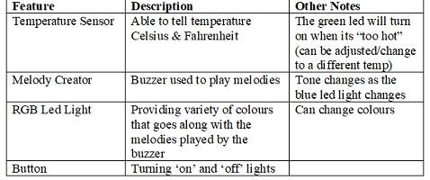
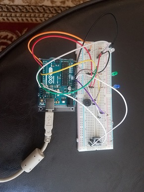

# Exploring Electronics - Gurpreet R.

## Day 1: Reflection

After completing the first day of this module and getting a chance to go through the varies exercises, I am excited to see what I can learn through the week. I did not have much expectations for this module, so after seeing the kit and learning about the assignments, it seems interesting. I had chosen this module because the name was intriguing. To learn more when it comes to electronics, I thought it would be good to get some skills and learn some new tools that could be beneficial in the future. Also I am more of a kinesthetic learner, so it was nice to know it’s more of a hands on course. Especially during the pandemic, it is not enjoyable to just be sitting on the computer listening to lectures and do readings, so that was also an factor. I have learned about coding in one of my courses before and I really loved it, so when I saw there was coding in this, it was another reason to chose it. I hope to learn more about coding and get familiar with circuits. As well, be able to create small inventions of my own. Also, the skills that could be learned with the programs/software’s, seem to be ones that would be useful in the future, since everything is become more digital. Hoping to have fun in this mini course! 

## Day 2: Results
Day 2 Sketch: https://github.com/gurpreet2396/Day-2-Sketch.git

Doing the varies exercises for Day 2 was fun. It was great getting to experiment with RBG LED thermometer. There were some challenges, such as putting the wires in the correct places and making sure all wires were stable enough to work. For example, with the colour order I would have issues with the colour order, but then I realized that one of my wires was in the wrong position which caused the problem. After making sure of those things, my device worked well! The temperature was very accurate which was great to see.

## Arduino build-off results

Final Product Sketch: https://github.com/gurpreet2396/Final-Product-Sketch.git

This device I had put together, is a small device to help kids learn how to tell temperature and also give kids the opportunity to create different melodies. By adding the code and setting up the equipment, the device will start. 

There is RGB led light that changes colours every 3 seconds to bring attention and some fun to the device. There are also two other led lights attached to the breadboard, they are both attached to another element on the board. The green led light is connected to the thermometer, where it is functioned to turn on when it is “too hot.” The temperature is able to be adjusted to determined what is considered to be “too hot” on the device. The blue led light is connected to the buzzer. It lights up when the buzzer plays a note. A melody can be added and can also be controlled by the button. It is meant to be educational to help kids learn how to understand temperature. They can play around with the thermometer and see how the temperature changes. Also playing around with lights and making new melody. They get the chance to express themselves through music and coding. 

## Final reflection & summary
  It was a fun experience doing this module. I have learned some new tools that I could use later on and it was enjoyable creating different codes. Opened up new ideas and learning opportunities. I have learned coding before from a different software but haven’t done it with an Arduino board. It did make it a bit easier when it came to putting in codes and adjusting the orders. Getting used to the Solderless breadboard was a bit confusing at first but after playing around with it more, I found it very useful. I have heard Github but never really used it. It took a few minutes to get used to it and see how things work. It is a program I will be trying out more. Doing the exercises were great, it was very rewarding once I got the hoped results. What I have found challenging was the final project. Finding a way to incorporate the different elements and adding the codes in, was hard. I had restarted at least 8 times, ended up being very frustrated. Though in the end, I was content with the results. Despite that only challenge, everything else was great and useful. Watching YouTube videoss on different ways people use the Arduino Board, there are a lot of ways to incorporate this in everyday life. I was thinking about purchasing an Arduino board and the other equipment from this package as well, other thinks like sound sensors. Thinking of “installing” sensors around the house, experiment with light and power lamps. There can be lots of possibilities and I am excited to see what I can create when I play with this in my free time!
